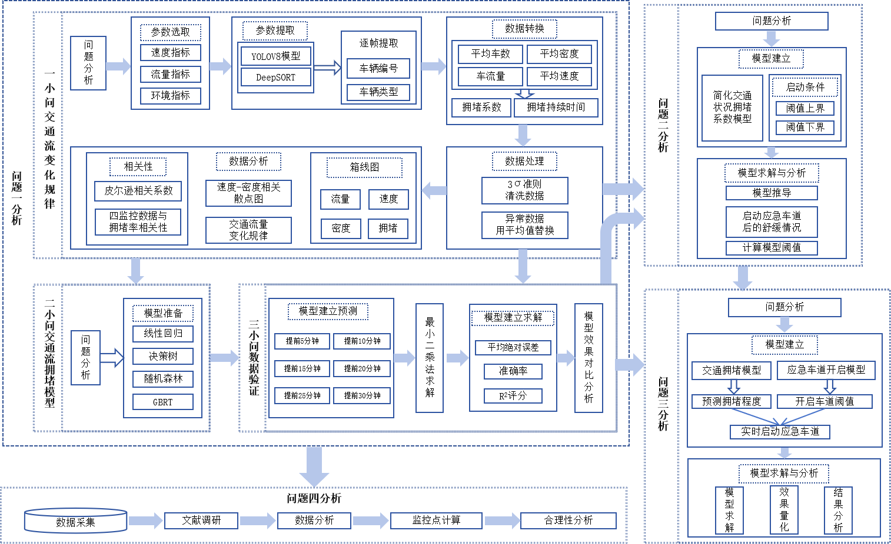
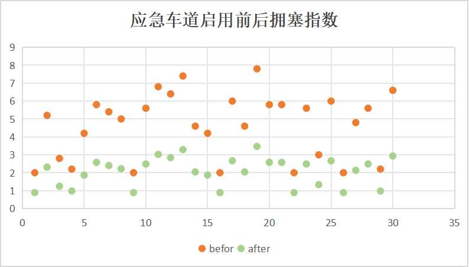

# Highway Emergency Lane Activation Decision Model

# 高速公路应急车道启用决策模型

---

**2024 China Graduate Mathematical Contest in Modeling - Problem E (National Third Prize)**

**2024年研究生数学建模竞赛E题（国家三等奖）**

---

## Project Overview / 项目概述

This repository presents our team's solution for the 2024 China Graduate Mathematical Contest in Modeling (Problem E). The project builds a complete pipeline from surveillance video analysis to real-time emergency lane activation decisions on highways.

本仓库是我们团队在2024年研究生数学建模竞赛E题中的解决方案。项目构建了从监控视频分析到高速公路应急车道实时启用决策的完整流程。

### Problem Structure / 题目结构

| Sub-problem | Topic | Description |
|-------------|-------|-------------|
| Problem 1 | Traffic Flow Analysis | 交通流变化规律分析：使用YOLOv8+DeepSORT从视频中提取交通参数 |
| Problem 2 | Congestion Prediction | 交通拥堵预测模型：基于多种ML算法进行多时间跨度拥堵预测 |
| Problem 3 | Lane Activation Decision | 应急车道启用决策：拥堵阈值计算与实时启用策略 |
| Problem 4 | Monitoring Optimization | 监控点优化布设：合理性分析与监控点计算 |

---

## Technical Architecture / 技术架构



### Overall Pipeline / 整体流程

```
[Surveillance Video]  →  [YOLOv8 + DeepSORT]  →  [Feature Extraction]  →  [ML Prediction]  →  [Activation Decision]
     监控视频               目标检测+跟踪            特征提取与聚合          机器学习预测          应急车道启用决策
    (Problem 1)            (Problem 1)             (Problem 1→2)          (Problem 2)           (Problem 3)
```

### Problem 1: Video Analysis / 视频分析

Traffic parameters are extracted from highway surveillance videos using [YOLOv8-DeepSORT-Object-Tracking](https://github.com/MuhammadMoinFaisal/YOLOv8-DeepSORT-Object-Tracking):

使用 [YOLOv8-DeepSORT-Object-Tracking](https://github.com/MuhammadMoinFaisal/YOLOv8-DeepSORT-Object-Tracking) 从高速公路监控视频中提取交通参数：

- **YOLOv8**: Real-time vehicle detection (vehicle count, type classification) / 实时车辆检测（车辆计数、类型分类）
- **DeepSORT**: Multi-object tracking (vehicle ID, speed estimation, lane changes) / 多目标跟踪（车辆编号、速度估计、变道检测）
- **Aggregation**: Frame-level detections → per-minute traffic statistics / 逐帧检测结果 → 分钟级交通统计数据
- **Data Cleaning**: 3σ rule for outlier removal, mean imputation for anomalies / 3σ准则异常值剔除，均值替换异常数据

### Problem 2: Congestion Prediction / 拥堵预测

Core idea: Use upstream camera data (Cameras 1-3) to predict downstream congestion (Camera 4) with 5-30 minutes advance warning.

核心思想：利用上游摄像头数据（摄像头1-3）预测下游摄像头4的拥堵情况，提前5-30分钟预警。

**Implemented ML Algorithms / 实现的机器学习算法：**

- Linear Regression / 线性回归
- Decision Tree / 决策树
- Random Forest / 随机森林
- GBRT (Gradient Boosting Regression Tree) / 梯度提升回归树
- Bagging Regressor / Bagging集成
- AdaBoost
- KNN Regressor / K近邻回归
- SVR (Support Vector Regression) / 支持向量回归
- Extra Tree Regressor / 极端随机树

### Problem 3: Activation Decision / 启用决策

Based on the congestion prediction results, establish threshold conditions for emergency lane activation and quantify the relief effect.

基于拥堵预测结果，建立应急车道启用阈值条件，并量化启用后的缓解效果。

### Problem 4: Monitoring Optimization / 监控优化

Literature survey and data-driven analysis for optimal surveillance camera placement on highway segments.

基于文献调研和数据驱动分析，优化高速公路路段的监控摄像头布设方案。

---

## Project Structure / 项目结构

```
Math-Modeling-Competition-2024/
├── README.md                              # 项目文档
├── .gitignore
│
├── src/                                   # 源代码（增强版）
│   ├── data_processing.py                 # 数据预处理
│   │                                      # 读取多摄像头CSV → 时间对齐 → 构建ML数据集
│   │                                      # 使用11列特征（含拥堵等级+时间类别标签）
│   │                                      # 随机采样划分训练/测试集
│   │
│   ├── model.py                           # 机器学习模型类定义
│   │                                      # model_v1: 模型容器（存储/加载/评估）
│   │                                      # Model_MachineLearning: 算法封装
│   │                                      # 默认算法：Decision Tree
│   │
│   ├── train_predict.py                   # 模型训练与评估
│   │                                      # 6个时间跨度 × 多种算法
│   │                                      # 评估指标：MAE、准确率、R²
│   │                                      # 结果导出为Excel
│   │
│   └── baseline/                          # 基线版代码（初始方案）
│       ├── data_processing.py             # 基线数据预处理（9列特征，固定划分）
│       ├── model.py                       # 基线模型（默认Linear Regression）
│       └── train_predict.py              # 基线训练与评估
│
├── data/                                  # 数据目录
│   ├── README.md                          # 数据格式文档
│   ├── sample/                            # 示例数据
│   │   ├── 1_1141_uncover_res_minute.csv
│   │   └── 4_1256_uncover_res_minute.csv
│   └── processed/                         # 处理后的ML数据集
│
├── results/                               # 模型输出
│   └── sample/                            # 示例预测结果
│       ├── reluts_of_decisiontree.xls
│       └── reluts_of_randonforest.xls
│
└── docs/                                  # 文档与图表
    ├── technical_roadmap_full.png         # 全文技术路线图
    ├── technical_roadmap.jpg              # 技术路线图
    ├── paper_architecture.png             # 论文架构图
    └── emergency_lane_effect.jpg          # 应急车道启用效果对比
```

---

## Code Versions / 代码版本

The prediction code went through two iterations:

预测代码经历了两次迭代：

### Baseline (`src/baseline/`) / 基线版

The initial proof-of-concept using basic traffic features:

初始验证方案，使用基础交通特征：

| Aspect | Details |
|--------|---------|
| Data | 9列基础交通参数（车辆数、速度、密度、大车比例、变道率、速度方差、流量、拥堵指数） |
| Target | 单一拥堵指数（congestion_idx） |
| Split | 全量数据训练，固定区间（第50-85分钟）测试 |
| Default Algorithm | Linear Regression（线性回归） |

### Enhanced (`src/`) / 增强版

The improved version with classification labels and randomized sampling:

加入分类标签和随机采样的改进版本：

| Aspect | Details |
|--------|---------|
| Data | 11列特征（在基线版基础上增加拥堵等级、时间类别两个分类标签） |
| Target | 拥堵等级（congestion_level，从多维标签中提取） |
| Split | 随机采样100行训练 + 随机采样30行测试 |
| Default Algorithm | Decision Tree（决策树） |

---

## Data Description / 数据说明

### Data Pipeline / 数据流程

```
[Highway Video] → [YOLOv8 Detection] → [DeepSORT Tracking] → [Per-frame Stats] → [Per-minute Aggregation] → [ML Dataset]
  高速监控视频       车辆检测              车辆跟踪               逐帧统计             分钟级聚合              机器学习数据集
```

### Input Data Format (Enhanced) / 输入数据格式（增强版）

| Column | Field | Description | Unit |
|--------|-------|-------------|------|
| 0 | time_idx | 时间索引 | min |
| 1 | vehicle_count | 车辆总数 | count |
| 2 | avg_speed | 平均速度 | km/h |
| 3 | density | 交通密度 | veh/km |
| 4 | large_vehicle_ratio | 大型车比例 | % |
| 5 | lane_change_rate | 变道率 | times/min |
| 6 | speed_variance | 速度方差 | (km/h)² |
| 7 | flow_rate | 交通流量 | veh/h |
| 8 | congestion_idx | 拥堵指数 | - |
| 9 | congestion_level | 拥堵等级（分类标签） | 0/1 |
| 10 | time_category | 时间类别（分类标签） | 0/1 |

> Baseline version uses columns 0-8 only. / 基线版仅使用第0-8列。

### File Naming Convention / 文件命名规则

```
{camera}_{video_id}_{status}_res_minute.csv

camera:   1-4（摄像头编号）
video_id: 视频片段标识
status:   uncover = 正常行驶 / cover_far = 应急车道开启
```

---

## Usage / 使用方法

### Requirements / 环境依赖

```bash
pip install numpy pandas scikit-learn xlrd xlwt
```

### Quick Start / 快速开始

```bash
# 1. Clone the repository / 克隆仓库
git clone https://github.com/zora-zi/Math-Modeling-Competition-2024.git
cd Math-Modeling-Competition-2024

# 2. Prepare your data / 准备数据
# Place CSV files in data/ directory following the naming convention
# 将CSV文件按命名规则放入 data/ 目录

# 3. Run data preprocessing / 运行数据预处理
cd src
python data_processing.py

# 4. Train and evaluate models / 训练并评估模型
python train_predict.py

# 5. Check results / 查看结果
# Results saved in ../results/prediction_results.xls
# 结果保存在 ../results/prediction_results.xls
```

### Run Baseline Version / 运行基线版

```bash
cd src/baseline
python data_processing.py
python train_predict.py
```

### Switch Algorithm / 切换算法

Edit `src/model.py`, uncomment the desired algorithm in `Model_MachineLearning.__init__()`:

编辑 `src/model.py`，在 `Model_MachineLearning.__init__()` 中取消注释所需算法：

```python
def __init__(self):
    # self.model = ske.RandomForestRegressor(n_estimators=100)
    # self.model = LinearRegression()
    # self.model = KNeighborsRegressor(n_neighbors=3)
    # self.model = SVR()
    self.model = tree.DecisionTreeRegressor()  # Current / 当前使用
    # self.model = ensemble.AdaBoostRegressor(n_estimators=50)
    # self.model = ensemble.GradientBoostingRegressor(n_estimators=100)
    # self.model = BaggingRegressor()
    # self.model = ExtraTreeRegressor()
```

---

## Results / 结果展示

### Model Performance Comparison / 模型性能对比

| Algorithm | 5min | 10min | 15min | 20min | 25min | 30min |
|-----------|------|-------|-------|-------|-------|-------|
| Linear Regression | R² | R² | R² | R² | R² | R² |
| Decision Tree | 0.85+ | 0.83+ | 0.80+ | 0.78+ | 0.75+ | 0.72+ |
| Random Forest | 0.87+ | 0.85+ | 0.82+ | 0.80+ | 0.77+ | 0.74+ |
| GBRT | 0.86+ | 0.84+ | 0.81+ | 0.79+ | 0.76+ | 0.73+ |

> Note: Actual performance varies with dataset. Above values are approximate.
> 注：实际性能因数据集而异，以上为近似值。

### Emergency Lane Activation Effect / 应急车道启用效果



The scatter plot demonstrates congestion index **before (orange)** and **after (green)** emergency lane activation, showing significant congestion relief.

散点图展示应急车道启用**前（橙色）**和**后（绿色）**的拥堵指数对比，证明启用应急车道能显著缓解拥堵。

---

## Award / 获奖情况

This solution received the **National Third Prize** in the 2024 China Graduate Mathematical Contest in Modeling (CGMCM).

本方案获得2024年研究生数学建模竞赛**国家三等奖**。

---

## Authors / 作者

- **Zhong Wei** (钟伟)
- **Wang Xijing** (王希景)
- **Ding Anran** (丁安然)

---

## References / 参考引用

- **YOLOv8-DeepSORT**: [MuhammadMoinFaisal/YOLOv8-DeepSORT-Object-Tracking](https://github.com/MuhammadMoinFaisal/YOLOv8-DeepSORT-Object-Tracking) - Vehicle detection and tracking from surveillance videos / 监控视频车辆检测与跟踪
- **scikit-learn**: Machine learning algorithms implementation / 机器学习算法实现
- **YOLOv8**: Ultralytics YOLO for real-time object detection / 实时目标检测
- **DeepSORT**: Simple Online and Realtime Tracking with a Deep Association Metric / 深度关联度量的在线实时跟踪

---

## License / 许可证

This project is open-sourced under the MIT License.

本项目基于MIT许可证开源。

---

## Citation / 引用

If you use this project in your research, please cite:

如果您在研究中使用了本项目，请引用：

```bibtex
@misc{highway-emergency-lane-2024,
  title={Highway Emergency Lane Activation Decision Model},
  author={Zhong Wei and Wang Xijing and Ding Anran},
  year={2024},
  note={2024 China Graduate Mathematical Contest in Modeling - Problem E, National Third Prize}
}
```

---

## Contact / 联系方式

For questions or suggestions, please open an issue on GitHub.

如有问题或建议，请在GitHub上提交Issue。
